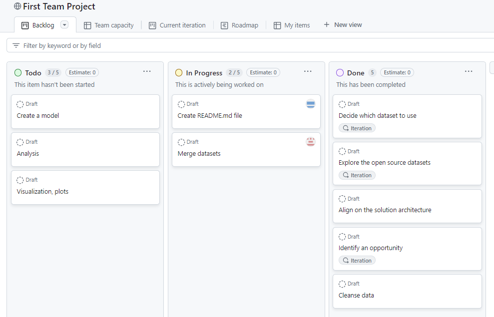

# Team Project Part 1

## Description

In your assigned team of 4, you'll collaboratively create a program with a database to analyze data from an open-sourced dataset. 

For example, your team might wish to examine the relationship between the length of a movie and the ratings users give the movie on a popular website. Or you may wish to explore the relationship between the size of a dog breed and the associated genetic ailments of that breed. Teams are encouraged to pick a dataset that interests you, is robust enough that you have flexibility to practice your skills, and that is well-suited for showcasing business impact.

The task in front of your team is deliberately open-ended. Your team will have to make decisions together:
* How will you select your dataset?
    - Identify Potential Sources: Research various public data repositories such as government databases, academic research sites, and Statistics Canada that provide relevant data on minimum wage and unemployment rates.
    - Criteria for Selection:
        - Relevance: Ensure the dataset includes variables related to minimum wage and unemployment rates across different provinces and time periods.
        - Completeness: The dataset should have minimal missing values and cover a significant time span to allow for robust analysis.
        - Accuracy: Verify that the data comes from reputable sources to ensure accuracy and reliability.
        - Format: Prefer datasets in formats that are easy to work with, such as CSV or Excel files.
    - Example Datasets: Statistics Canada, Labour Market Reports

* How will you make sure all team members can contribute to the project?
    - Define Roles and Responsibilities: Assign specific tasks and roles based on each team member’s expertise and interests. For example, data cleaning, data analysis, regression analysis and report writing.
    - Regular Meetings: Schedule meetings to discuss progress, challenges, and next steps. Use collaborative tools for virtual meetings.
    - Shared Workspace: Utilize collaborative platforms such as GitHub for code sharing and version control, and Slack for real-time communication.
    - Documentation: Maintain thorough documentation of the project.

* How will you make decisions?
    - Consensus-Based Decisions: Encourage open discussions and gather input from all team members before making decisions.
    - Voting: For critical decisions where consensus cannot be reached, use a voting system to make a decision.
    - Lead Roles: Assign lead roles for major components of the project.
    - Feedback Loop: Establish a feedback loop where team members can raise concerns or suggest improvements at any stage of the project.

* What is the question you're trying to answer through your data analysis?
    - What is the impact of minimum wage changes on unemployment rates across different provinces in Canada?
        - How does the relationship between minimum wage and unemployment rate vary across different provinces?
        - Are there any provinces where the minimum wage has a statistically significant impact on unemployment rates?
        - What other factors might influence the unemployment rate alongside minimum wage changes?

* What tasks need to be completed to get to your final output?
    - Project Planning: Define the research question. Select the dataset and set up a shared workspace. Assign roles and responsibilities.
    - Data Collection and Preparation:Collect the dataset from selected sources. Clean the data: handle missing values, format data, and ensure consistency. Merge datasets. Perform exploratory data analysis to understand the dataset.
    - Analysis: Conduct descriptive statistics to summarize the data. Perform regression analysis to determine the relationship between minimum wage and unemployment rates. Analyze results and interpret the significance and strength of the relationships.
    - Visualization: Create visualizations such as scatter plots, regression lines, and summary charts to illustrate the findings.
    - Reporting: A comprehensive report detailing the impact of minimum wage on unemployment rates across Canada and its provinces.

At the end of the module, all team members are encouraged to fork the repo onto their profile so that prospective employers can view the project. 

Datasets you can use:
* [Kaggle](https://www.kaggle.com/datasets)
* [collections (datahub.io)](https://datahub.io/collections)
* [Dataset Search (google.com)](https://datasetsearch.research.google.com/)
* [Data.gov Home - Data.gov](https://data.gov/) (US)
* [Datasets and Portals (science.gc.ca)](https://science.gc.ca/site/science/en/open-science/datasets-and-portals)
* [Welcome - Ontario Data Catalogue](https://data.ontario.ca/)

The Technical Facilitator will deliver brief learning sessions on the following topics:

* GitHub and coding best practices when working in a team  
* How to communicate the value and impact of their work
  
This project applies skills from the following previous modules:

* Introduction to Building Software (Git, Shell & Python) 
* SQL 
* Applying Statistical Concepts (Linear regression, classification, and resampling) 

## Learning Outcomes
By the end of team project, participants will be able to:
* Resolve merge conflicts
* Describe common problems or challenges a team encounters when working collaboratively using Git and GitHub
* Create a program to analyze a dataset with contributions from multiple team members

## Instructions

1. Explore the open source datasets above.
    - Historical minimum wage rates in Canada - Historical Minimum Wage Rates in Canada
        - https://open.canada.ca/data/en/dataset/390ee890-59bb-4f34-a37c-9732781ef8a0/resource/2ddfbfd4-8347-467d-b6d5-797c5421f4fb
    - Labour force characteristics, monthly, seasonally adjusted and trend-cycle
        - https://www150.statcan.gc.ca/t1/tbl1/en/tv.action?pid=1410028701&pickMembers%5B0%5D=1.1&pickMembers%5B1%5D=3.1&pickMembers%5B2%5D=4.1&pickMembers%5B3%5D=5.1&cubeTimeFrame.startMonth=01&cubeTimeFrame.startYear=2020&cubeTimeFrame.endMonth=05&cubeTimeFrame.endYear=2024&referencePeriods=20200101%2C20240501

2. As a team, decide which dataset you would like to analyze and determine:
    - We choose data set examining Unemployment rate in Canada and minimum wage

    1. What is the primary focus within the dataset?
        - The primary focus within the datasets are to analyze labor force characteristics in Canada, including the unemployment rate, minimum wage, and other relevant economic indicators. 
        - The datasets aim to understand the dynamics of the labor market and how different variables influence the unemployment rate.
    2. What are potential relationships in the data that you could explore?
        - Unemployment Rate vs. Minimum Wage: Analyze how changes in the minimum wage impact the unemployment rate.
        - Unemployment Rate vs. Minimum Wage by Province: Compare how changes in the minimum wage affect the unemployment rate across different provinces. Identify if some provinces experience more significant impacts than others.
        - The following would require additional datasets:
            - Unemployment Rate vs. GDP Growth Rate: Explore how economic growth, as measured by GDP, affects unemployment.
            - Unemployment Rate vs. Economic Indicators (e.g., Inflation, Industry Growth): Analyze how various economic indicators correlate with the unemployment rate.
    3. What are key questions your project could answer? 
        - Impact of Minimum Wage on Unemployment: 
            - How does an increase or decrease in the minimum wage affect the unemployment rate in Canada?
            - What is the impact of minimum wage changes on unemployment rates across different provinces in Canada? 
        - For Future Projects:
            - COVID-19 Pandemic Impact: How did the COVID-19 pandemic affect labor force characteristics from January 2020 onwards?
            - Demographic Analysis: How do different demographic groups (e.g., age, gender) within the population experience changes in employment and unemployment?

3. Create rules of engagement to guide how your team will work together (Examples can be found below under [Resources](https://github.com/UofT-DSI/team_project/edit/main/team_project_1.md#resources).
    - We used task tracking to guide team work. It can be found in the team project tracker.

    

4. Create a new repository for your project. Hint: this repo has some features commonly found in industry repos. 
5. Work on the "Advanced Topics" section of [LearnGitBranching](https://learngitbranching.js.org/) to learn more about rebasing
        We push changes to our own branches, e.g. dmytro
        Then we create a pull request to merge with team-project-1
        Please post in the channel once you've created your pull request. It's good practice to have peer reviews.
        After the merge, it's a good practice to delete your branch to avoid a mess in the future. Keep reading...
        Then we go to VS Code, switch to branch team-project-1 and do pull to synchronize.
        To continue working on your changes, create your own branch again (e.g. git checkout -b dmytro) and follow steps 1-6.
        Replace steps 4-6 if you merge your own branch with team-project-1.

6. Learn why merge conflicts occur via this [article](https://www.atlassian.com/git/tutorials/using-branches/merge-conflicts#:~:text=Understanding%20merge%20conflicts,automatically%20determine%20what%20is%20correct.)
7. Determine what roles the various team members will play on the team, which tasks need to be completed and assigned to which team members, and what your team norms will be with respect to code reviews, approvals and merges. 
Dem
8. At the end of the week, please record a 3-5 minute video individually that answers the following questions:
    1. What did you learn?
    2. What challenges did you face?
    3. How did you overcome those challenges?
    4. If you had more time to complete your project, what would you add to it?
    5. What strengths do you bring to a team work environment?
9. Have fun! This project is yours. This is the time to create something that prospective employers can consider when reviewing your application for a role, so be sure to clearly demonstrate the business value that your project could provide. What will your project tell them about you, your skills and your ability to work effectively on a team. 
  
## Questions to discuss when reviewing your dataset

* What are the key variables and attributes in your dataset?
    - Key variables and attributes in the dataset are :
        - Year: The year in which the data was recorded.
        - Province/Territory: The geographical region within Canada (e.g., Ontario, Quebec, Alberta).
        - Minimum Wage: The minimum hourly wage set by provincial or territorial legislation.
        - Unemployment Rate: The percentage of the labor force that is unemployed and actively seeking employment.

* How can we explore the relationships between different variables?
    - To explore relationships between variables such as minimum wage, unemployment rate, and year across provinces/territories, we can use several analytical methods:
    - Correlation Analysis: Calculate correlation coefficients to measure the strength and direction of linear relationships between minimum wage, unemployment rate, and potentially other variables like inflation or GDP.
    - Time Series Analysis: Track changes in minimum wage and unemployment rate over time within each province/territory to identify trends and seasonality.
    - Regression Analysis: Use regression models to understand the impact of minimum wage changes on unemployment rates, controlling for other factors like economic indicators or inflation.
    - Visualization: Create visualizations such as scatter plots (for examining correlations), line graphs (for time series analysis), and heatmaps (for geographical trends) to visually interpret patterns and relationships in the data.

* Are there any patterns or trends in the data that we can identify?
    - Minimum Wage Increases Over Time: Identify whether minimum wage rates have generally increased over the years across different provinces/territories.
    - Unemployment Rate Fluctuations: Explore if there are cyclical patterns in unemployment rates, such as during economic recessions or periods of growth.
    - Correlation Over Time: Determine if there's a noticeable correlation between changes in minimum wage and subsequent changes in unemployment rates in specific years.
    - Regional Unemployment Trends: Analyze if certain provinces consistently have higher or lower unemployment rates compared to others and how minimum wage policies correlate with these trends.
    - Comparative Analysis: Compare the effectiveness of minimum wage policies across different provinces/territories with varying economic structures and demographics.

* Who is the intended audience for our data analysis?
    - The data can be directed at various groups. Government/Policy makers/Bank of Canada to help inform:
    - Government and Policymakers:
        - Interest Rate Implications: Understanding the relationship between minimum wage adjustments and economic indicators like inflation can inform decisions on interest rate hikes.
        - Minimum Wage Policy Timing: Analyzing historical trends can guide the timing and magnitude of minimum wage increases to mitigate economic disparities and support sustainable growth.
    - Businesses and the Public:
        - Strategic Decision Making: Businesses can anticipate the impact of minimum wage changes on operational costs, labor market dynamics, and consumer spending patterns.
        - Public Awareness: Insights into wage increase decisions foster public understanding and engagement on economic policies affecting household income and purchasing power.
    - Employee Advocacy and Economic Equity:
        - Addressing Cost of Living: Employees advocating for higher minimum wages can use data on inflation-adjusted income trends to support their arguments.
        - Income Inequality Awareness: Highlighting how wage increases align with inflation helps address concerns about widening income gaps between different socioeconomic groups.
    - Support for Small and Medium-Sized Enterprises 
        - Economic Incentives: Provides economic incentives and strategies for Small and Medium-Sized Enterprises to manage wage-related impacts effectively.
        - Operational Adaptation: Small and Medium-Sized Enterprises can use insights to adjust operational strategies, workforce planning, and pricing models in response to changing wage dynamics.

* What is the question our analysis is trying to answer?
    - The primary question our analysis seeks to answer is: What is the impact of minimum wage changes on unemployment rates in Canada and across different provinces/territories? This involves examining both the statistical significance and the magnitude of this impact.

* Are there any specific libraries or frameworks that are well-suited to our project requirements?
    - Pandas: Essential for data manipulation and analysis, especially for handling large datasets, cleaning data, and performing aggregations.
    - NumPy: Fundamental for numerical operations and computations, supporting mathematical functions and array manipulations.
    - Matplotlib and Seaborn: These libraries can help create visualizations such as scatter plots, line graphs, bar charts, and heatmaps to explore trends and correlations in the data.
    - Statsmodels: Statsmodels provides tools for statistical modeling, including regression analysis and hypothesis testing, which are crucial for assessing the impact of minimum wage on unemployment rates.

## Requirements 
* Each team member must create, review, and merge a pull request 
* Each team member must write one PR description
* Each project must design, implement, and test regression
* Each team must create a README that explains the project, how the team approached their project, and any relevant details to their team project, including the team's Rules of Engagement. Keep in mind that the repo will be on each team member's profile, so be thoughtful about the details you include here. 
* Each team member must create a video about their learnings and experience 

## Resources

* [Interactive Git Tutorial](https://learngitbranching.js.org/)
* [Interactive Rebase: Git In Practice - Part 2 - Thinktecture AG](https://www.thinktecture.com/en/tools/git-interactive-rebase/)
* [Git merge conflicts | Atlassian Git Tutorial](https://www.atlassian.com/git/tutorials/using-branches/merge-conflicts#:~:text=Understanding%20merge%20conflicts,automatically%20determine%20what%20is%20correct.)

**Rules of Engagement Examples**

* [Five Rules of Engagement for Your High-Performing Team - High5 Leadership](https://high5leadership.com/five-rules-of-engagement-for-your-high-performing-team/)
* [Ground Rules for Teams: Definition and Examples | Indeed.com](https://www.indeed.com/career-advice/career-development/ground-rules-for-teams)
* [8 Ground Rules for Great Meetings (hbr.org)](https://hbr.org/2016/06/8-ground-rules-for-great-meetings)
* [16 Ground Rules for Group Work | Facilitator School](https://www.facilitator.school/ground-rules/ground-rules-for-group-work)
* [Chapter 8 Working in Teams | Research Software Engineering with Python (third-bit.com)](https://third-bit.com/py-rse/teams.html#teams-coc)
